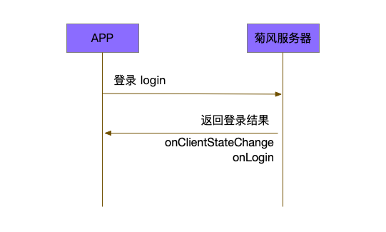
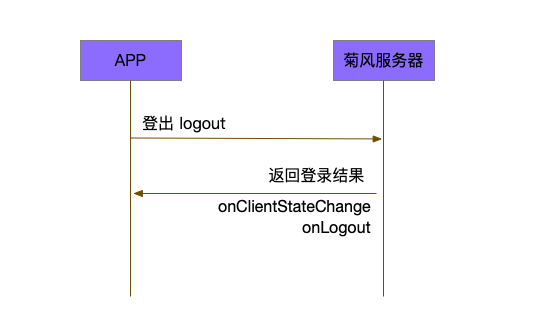

一对一会话集成
============================

.. highlight:: java

前提条件
----------------------------

- Android SDK API 等级 16 或以上

- 支持 Android 4.1 或以上版本的移动设备

- 有效的菊风开发者账号（`免费注册 <http://developer.juphoon.com/signup>`_ ）

获取 AppKey
----------------------------

AppKey 是应用在 菊风云平台 中的唯一标识。需要在 SDK 初始化的时候使用，AppKey 获取请参考 :ref:`创建应用 <创建应用>` 。

配置 SDK
----------------------------

下载 SDK
>>>>>>>>>>>>>>>>>>>>>>>>>>>>

点击 `Android SDK <//todo>`_ 进行下载。

导入 SDK
>>>>>>>>>>>>>>>>>>>>>>>>>>>>

//todo 修改内容

1. 下载 SDK，拷贝 libs 文件夹内的 armeabi-v7a、X86、mtc.jar 、JCSDK.jar 和 zmf.jar 到您工程目录中的 libs 目录下，并打开工程，如下图所示:

.. image:: images/android_sdklist.png

.. image:: images/quickstart_android1.png

2. 为能连接到我们的 so 库，在您工程 build.gradle 文件中确保增加以下配置，如图:

.. image:: images/set_sdk_android2.png

3. 修改您工程中 Application 配置文件 AndroidManifest.xml，**请确保已经加入以下特性和权限信息**。具体信息可以参考 :ref:`Android 权限说明<Android 权限说明>` 。
::

    <uses-feature android:name="android.hardware.camera" />
    <uses-feature android:name="android.hardware.camera.autofocus" />
    <uses-permission android:name="android.permission.INTERNET" />
    <uses-permission android:name="android.permission.ACCESS_NETWORK_STATE" />
    <uses-permission android:name="android.permission.ACCESS_WIFI_STATE" />
    <uses-permission android:name="android.permission.READ_PHONE_STATE" />
    <uses-permission android:name="android.permission.WAKE_LOCK" />
    <uses-permission android:name="android.permission.CAMERA" />
    <uses-permission android:name="android.permission.RECORD_AUDIO" />
    <uses-permission android:name="android.permission.MODIFY_AUDIO_SETTINGS" />
    <uses-permission android:name="android.permission.WRITE_EXTERNAL_STORAGE" />
    <uses-permission android:name="android.permission.VIBRATE"/>
    <uses-permission android:name="android.permission.BLUETOOTH" />
    <uses-permission android:name="android.permission.SYSTEM_ALERT_WINDOW" />

.. note::

    您在 AndroidManifest 中进行权限配置时，请确保您能够获得打开摄像头、音视频录制等相关权限。

4. 配置完成后编译运行，如果没有报错，恭喜您，您已经成功配置 SDK，可以进行 SDK 初始化了。

.. note:: SDK 不支持模拟器运行，请使用真机。

引入 SDK
>>>>>>>>>>>>>>>>>>>>>>>>>>>>

在文件头部引入导入（import）需要的包和类
例如::

  import com.juphoon.cloud.wrapper.JCCloudManager;

初始化 SDK
>>>>>>>>>>>>>>>>>>>>>>>>>>>>

开发者在使用 JC SDK 所有功能之前，必须先调用初始化方法初始化 SDK。 在 App 的整个生命周期中，开发者只需要将 SDK 初始化一次。

在你的程序的Application的**onCreate()** 中，加入JC SDK的初始化代码：

调用方法

::

  Boolean result = JCCloudManager.getInstance().initialize(context, appKey);

输入参数

.. list-table::
  :header-rows: 1

  * - 参数
    - 类型
    - 必填
    - 说明
  * - context
    - Context
    - 是
    - 应用上下文
  * - appKey
    - String
    - 是
    - 菊风云平台中的唯一标识

返回结果

.. list-table::
  :header-rows: 1

  * - 返回值
    - 返回类型
    - 说明
  * - result
    - Boolean
    - 判断是否初始化成功

.. note::

  SDK 的初始化方法必须在 Application onCreate 中，并且不能对初始化语句添加进程判断逻辑。
  另外，通过这种方法初始化后，所有的参数都为默认值。若想调整JCCloudManager实例对象的参数，请查看文件JCCloudManager.h文件查看属性，并通过setXXX方法进行调整。

账号管理
---------------------------

账号管理主要包括账号登录、账号登出和账号属性设置三个部分。

登录
>>>>>>>>>>>>>>>>>>>>>>>>>>>

登录涉及 JCClient 类及其回调 JCClientCallback，其主要作用是负责登录、登出管理及帐号信息存储。

只有登录成功后才能进行平台上的各种业务。服务器分为鉴权模式和非鉴权模式

 - 鉴权模式: 服务器会检查用户名和密码

 - 免鉴权模式: 只要用户保证用户标识唯一即可, 服务器不校验

.. note::

    目前只支持免鉴权模式，免鉴权模式下当账号不存在时会自动去创建该账号

在 App 整个生命周期，开发者只需要调用一次登录方法进行登录。之后无论是网络出现异常或者 App 有前后台的切换等，SDK 都会负责自动重连服务器。除非用户主动调用登出接口，或者因为帐号在其他设备登录导致该设备被登出。

登录过程如下:

登录参数设置（可选）
::::::::::::::::::::::::::::::::

登录之前，可以通过 setConfig() 方法对登录参数进行个性化配置，例如开发者可以通过此函数自定义服务器地址（如不设置则按照默认值登录）。

其中，服务器地址包括国际环境服务器地址和国内环境服务器地址：

**国际环境** 服务器地址默认为 ``http:intl.router.justalkcloud.com:8080`` 。

**国内环境** 服务器地址默认为 ``http:cn.router.justalkcloud.com:8080`` 。

调用方法

::

  Boolean result = JCCloudManager.getInstance().mClient.setConfig(key, value);

输入参数

.. list-table::
  :header-rows: 1

  * - 参数
    - 类型
    - 必填
    - 说明
  * - key
    - @ConfigKey String
    - 是
    - 参数关键字，具体可参见JCClient.ConfigKey//todo
  * - value
    - String
    - 是
    - 参数值

返回结果

.. list-table::
  :header-rows: 1

  * - 返回值
    - 返回类型
    - 说明
  * - result
    - Boolean
    - 返回 true 表示设置成功，false 表示设置失败

发起登录
::::::::::::::::::::::::::::::::::::

调用方法

::

  JCCloudManager.getInstance().mClient.login(username, password);

调用方法需要注意的有:

1. 在菊风云平台开启免鉴权
2. 用户名大小写不敏感
3. 用户名满足下述正则表达式
4. 密码没有限制

.. note:: 用户名为英文、数字和'+' '-' '_' '.'，长度不要超过64字符，'-' '_' '.'不能作为第一个字符。

输入参数

.. list-table::
  :header-rows: 1

  * - 参数
    - 类型
    - 必填
    - 说明
  * - username
    - String
    - 是
    - 用户名(满足正则即可)
  * - password
    - String
    - 是
    - 用户密码(无限制)

返回结果

.. list-table::
  :header-rows: 1

  * - 返回值
    - 返回类型
    - 说明
  * - boolean
    - Boolean
    - ture表示用户登录成功，false表示用户登录失败

登录状态改变回调
::::::::::::::::::::::::::::::::::::

登录成功之后，首先会触发登录状态改变回调：

::

  void onClientStateChange(@JCClient.ClientState int state, @JCClient.ClientState int oldState);

参数介绍

.. list-table::
  :header-rows: 1

  * - 参数
    - 类型
    - 说明
  * - state
    - @JCClient.ClientState String
    - 当前状态值，详细内容参阅JCClient.ClientState
  * - oldState
    - @JCClient.ClientState String
    - 上一步状态值，详细内容参阅JCClient.ClientState

登录结果回调
:::::::::::::::::::::::::::::::::

然后会触发登录结果回调上报登录结果：

::

  void onLogin(boolean result, @JCClient.ClientReason int reason);

参数介绍

.. list-table::
  :header-rows: 1

  * - 参数
    - 类型
    - 说明
  * - result
    - boolean
    - true 表示登陆成功，false 表示登陆失败
  * - reason
    - @JCClient.ClientReason int
    - 上一步状态值，详细内容参阅JCClient.ClientReason

登出
>>>>>>>>>>>>>>>>>>>>>>>>>>>

登出是指断开与菊风服务器的连接，登出后不能进行平台上的各种业务操作。

登出过程如下：

发起登出
::::::::::::::::::::::::::::::

调用方法：

::

  Boolean result = JCCloudManager.getInstance().mClient.logout();

返回结果

.. list-table::
  :header-rows: 1

  * - 返回值
    - 返回类型
    - 说明
  * - result
    - Boolean
    - ture表示用户登出成功，false表示用户登出失败

登出回调
::::::::::::::::::::::::::::::::::::

登出方法会触发登出回调上报登出结果:

::

  void onLogout(@JCClient.ClientReason int reason);

参数介绍

.. list-table::
  :header-rows: 1

  * - 参数
    - 类型
    - 说明
  * - reason
    - @JCClient.ClientReason int
    - 登出原因，详细内容参阅JCClient.ClientReason

设置昵称
>>>>>>>>>>>>>>>>>>>>>>>>>>>

开发者可以通过 JCClient 类中的 displayName 属性设置昵称。同理可用于设置其他参数。

::

  JCCloudManager.getInstance().mClient.setDisplayName(displayName);

输入参数

.. list-table::
  :header-rows: 1

  * - 参数
    - 类型
    - 必填
    - 说明
  * - displayName
    - String
    - 是
    - 昵称

会话管理
---------------------------

相关内容介绍
>>>>>>>>>>>>>>>>>>>>>>>>>>>

**1. 会话实体类**

SDK 中用户与同一个对象的聊天信息集合，称为一个会话，用 JCConversationData 对象来表示。

会话有单人会话，群组会话等类型。

JCConversationData 对象包含会话id、会话类型、会话对端 UserId、会话名字等属性。

详细内容参阅 JCConversationData.h 文件。//todo

**2. 会话管理类**

会话管理主要涉及 JCCloudDatabase 类中的方法，用于会话的增删改查。

详细内容参阅 JCCloudDatabase.h文件//todo

打开数据库
:::::::::::::::::::::::::::

调用方法

::

  JCCloudManager.getInstance().open(Context context, String userId);

.. note:: 在登录时已经调用了该方法，开发者无需主动调用。

关闭数据库
:::::::::::::::::::::::::::

在主动调用登录数据库方法后，可以调用此方法关闭数据库。

调用方法

::

  JCCloudManager.getInstance().close();

**3. 数据库异步操作**

数据库操作要在同一线程中，可以通过调用 JCCloudManager 类中的异步调用方法实现数据库的异步操作。

详细内容参阅 JCCloudManager.h 文件//todo 或者参阅异步方法

调用方法

异步调用
::

  JCCloudManager.getInstance().dispatchIm(() -> { ... });

延时异步调用

::

  JCCloudManager.getInstance().dispatchImDelay(() -> { ... });

创建会话
>>>>>>>>>>>>>>>>>>>>>>>>>>>

发起会话
:::::::::::::::::::::::::::

发起一对一聊天，会根据传入的 serverUid 查询本地数据库有无此会话，没有则会自动创建。

调用方法

::

  long conversatioId = JCCloudDatabase.getInstance().getOrCreateConversation(
            type, serverUid,
            name, lastActiveTime);

输入参数

.. list-table::
  :header-rows: 1

  * - 参数
    - 类型
    - 必填
    - 说明
  * - type
    - @JCCloudConstants.ConversationType int
    - 是
    - 会话类型，一对一和群聊，此处为一对一，详细内容参阅JCCloudConstants.ConversationType
  * - serverUid
    - @NonNull String
    - 是
    - 服务器会话 uid，一对一实际是对方的个人 uid，群组 id 要创建成功才能获得
  * - name
    - @NonNull String
    - 是
    - 会话名字，只针对一对一会话有效
  * - lastActiveTime
    - long
    - 是
    - 最后活跃时间

返回结果

.. list-table::
  :header-rows: 1

  * - 返回值
    - 返回类型
    - 说明
  * - conversationId
    - long
    - 本地会话id，失败返回 -1

相关回调
:::::::::::::::::::::::::::

会话增加后，会触发回函数，函数在接口JCCloudManagerCallback中：

::

  void onConversationAdd(long conversationId);

参数介绍

.. list-table::
  :header-rows: 1

  * - 参数
    - 类型
    - 说明
  * - conversationId
    - long
    - 本地会话id

删除会话
>>>>>>>>>>>>>>>>>>>>>>>>>>>

删除会话分为删除单一会话和删除全部会话

删除单一会话
:::::::::::::::::::::::::::

调用该方法将删除单一会话，删除本地会话后内部将自动删除服务器会话。

调用方法

::

  JCCloudDatabase.getInstance().deleteConversation(conversationId);

输入参数

.. list-table::
  :header-rows: 1

  * - 参数
    - 类型
    - 必填
    - 说明
  * - conversationId
    - long
    - 是
    - 本地会话id

删除所有会话
:::::::::::::::::::::::::::

调用该方法将删除所有会话。

调用方法
::

  JCCloudDatabase.getInstance().deleteAllConversations();

相关回调
:::::::::::::::::::::::::::

会话增加后，会触发回调函数，该函数在接口JCCloudManagerCallback中：

::

  void onConversationDelete(long conversationId);

参数介绍

.. list-table::
  :header-rows: 1

  * - 参数
    - 类型
    - 说明
  * - conversationId
    - long
    - 本地本地会话id，-1表示所有会话

更新会话
>>>>>>>>>>>>>>>>>>>>>>>>>>>

更新会话信息
:::::::::::::::::::::::::::

调用该方法能更新会话的详细信息，如`是否置顶`，`未读消息数量`等。

调用方法

::

  JCCloudDatabase.getInstance().updateConversation(JCConversationData oldConversationData);

输入参数

.. list-table::
  :header-rows: 1

  * - 参数
    - 类型
    - 必填
    - 说明
  * - oldConversationData
    - JCConversationData
    - 是
    - 会话实体类

更新会话名字
:::::::::::::::::::::::::::

调用方法

::

  JCCloudDatabase.getInstance().updateConversationNameIfNeed(serverUid, name);

输入参数

.. list-table::
  :header-rows: 1

  * - 参数
    - 类型
    - 必填
    - 说明
  * - serverUid
    - String
    - 是
    - 服务器会话id
  * - name
    - String
    - 是
    - 会话名字

更新会话图标
:::::::::::::::::::::::::::

用于更新会话的图标

调用方法

::

  JCCloudDatabase.getInstance().updateConversationIconIfNeed(serverUid, icon);

输入参数

.. list-table::
  :header-rows: 1

  * - 参数
    - 类型
    - 必填
    - 说明
  * - serverUid
    - String
    - 是
    - 服务器会话id
  * - icon
    - String
    - 是
    - 会话图标

保存草稿
:::::::::::::::::::::::::::

将保存对话框中的文本内容到本地会话数据库，在保存前会先删除之前保存的草稿内容。

调用方法
::

  JCCloudDatabase.getInstance().saveDraft(conversationId, content, contentType, filePath);

输入参数

.. list-table::
  :header-rows: 1

  * - 参数
    - 类型
    - 必填
    - 说明
  * - conversationId
    - long
    - 是
    - 本地会话id
  * - content
    - String
    - 是
    - 文本内容
  * - contentType
    - String
    - 是
    - 内容类型，详细内容参阅
  * - content
    - String
    - 是
    - 文件路径

清除草稿
:::::::::::::::::::::::::::

调用该方法将清除本都会话数据库中的草稿数据。

调用方法
::

  JCCloudDatabase.getInstance().clearDraft(conversationId);

输入参数

.. list-table::
  :header-rows: 1

  * - 参数
    - 类型
    - 必填
    - 说明
  * - conversationId
    - long
    - 是
    - 本地会话id

设置会话所有消息本地已读
:::::::::::::::::::::::::::

调用该方法会把所有本地的会话未读消息设置成已读。

调用方法

::

  JCCloudDatabase.getInstance().markConversationRead(conversationId);

输入参数

.. list-table::
  :header-rows: 1

  * - 参数
    - 类型
    - 必填
    - 说明
  * - conversationId
    - long
    - 是
    - 本地会话id

设置会话置顶
:::::::::::::::::::::::::::

调用方法

::

  CCloudManager.getInstance().setConversationPriority(conversationId, isPriority, block);

输入参数

.. list-table::
  :header-rows: 1

  * - 参数
    - 类型
    - 必填
    - 说明
  * - conversationId
    - long
    - 是
    - 本地会话id
  * - isPriority
    - boolean
    - 是
    - 是否置顶，true表示置顶，false表示不置顶
  * - block
    - CloudOperationBlock
    - 否
    - 回调结果

设置会话免打扰
:::::::::::::::::::::::::::

会话免打扰后收到消息将不再发送提醒。

调用方法

::

  CCloudManager.getInstance().setConversationDnd(conversationId, dnd, block);

输入参数

.. list-table::
  :header-rows: 1

  * - 参数
    - 类型
    - 必填
    - 说明
  * - conversationId
    - long
    - 是
    - 本地会话id
  * - dnd
    - boolean
    - 是
    - 是否免打扰，true表示免打扰开启，false表示关闭
  * - block
    - CloudOperationBlock
    - 否
    - 回调结果

相关回调
:::::::::::::::::::::::::::

会话增加后，会触发回调函数：

::

  void onConversationUpdate(long conversationId);

参数介绍

.. list-table::
  :header-rows: 1

  * - 参数
    - 类型
    - 说明
  * - conversationId
    - long
    - 本地本地会话id，-1表示所有会话

查询会话
>>>>>>>>>>>>>>>>>>>>>>>>>>>

查询单个会话信息
:::::::::::::::::::::::::::

查询单个会话有两种方式，分别为根据会话ID（conversationId）查询和根据服务器会话id（serverUid）查询 ，开发者可以根据需求选择调用。

**1. 根据会话ID查询**

调用方法

::

  JCConversationData conversationData = JCCloudDatabase.getInstance().queryConversation(conversationId);

输入参数

.. list-table::
  :header-rows: 1

  * - 参数
    - 类型
    - 必填
    - 说明
  * - conversationId
    - long
    - 是
    - 本地会话id

返回结果

.. list-table::
  :header-rows: 1

  * - 返回值
    - 返回类型
    - 说明
  * - conversationData
    - JCConversationData
    - 返回具体的会话实体类

**2. 根据服务器会话id查询**

调用方法

::

  JCCloudDatabase.getInstance().queryConversationByServerUid(serverUid);

输入参数

.. list-table::
  :header-rows: 1

  * - 参数
    - 类型
    - 必填
    - 说明
  * - serverUid
    - long
    - 是
    - 服务器会话id

查询所有会话信息
:::::::::::::::::::::::::::

开发者可以调用该接口获取 SDK 在本地数据库生成的会话列表，置顶会话会排在最前，获取到的其余会话按照时间倒序排列。

调用方法

::

  JCCloudDatabase.getInstance().queryConversations();

返回结果

.. list-table::
  :header-rows: 1

  * - 返回值
    - 返回类型
    - 说明
  * - list
    - List<JCConversationData>
    - 会话实体类（JCConversationData）的列表

根据服务器会话ID查询本地会话ID
:::::::::::::::::::::::::::

调用方法

::

  JCCloudDatabase.getInstance().getConversation(serverUid)

输入参数

.. list-table::
  :header-rows: 1

  * - 参数
    - 类型
    - 必填
    - 说明
  * - serverUid
    - @NonNull String
    - 是
    - 服务器会话id

返回结果

.. list-table::
  :header-rows: 1

  * - 返回值
    - 返回类型
    - 说明
  * - conversationId
    - long
    - 本地会话id，失败返回 -1

根据服务器消息ID查询本地会话ID
:::::::::::::::::::::::::::

调用方法

::

  JCCloudDatabase.getInstance().getConversationByMessageId(messageId);

输入参数

.. list-table::
  :header-rows: 1

  * - 参数
    - 类型
    - 必填
    - 说明
  * - messageId
    - long
    - 是
    - 本地消息Id

返回结果

.. list-table::
  :header-rows: 1

  * - 返回值
    - 返回类型
    - 说明
  * - conversationId
    - long
    - 本地会话id，失败返回 -1

获得所有的未读消息数
:::::::::::::::::::::::::::

调用方法

::

  JCCloudDatabase.getInstance().getToltalUnreadMessageCount(includeDndConversation);

输入参数

.. list-table::
  :header-rows: 1

  * - 参数
    - 类型
    - 必填
    - 说明
  * - includeDndConversation
    - boolean
    - 是
    - 是否包含免打扰会话，true表示包含。false表示不包含

返回结果

.. list-table::
  :header-rows: 1

  * - 返回值
    - 返回类型
    - 说明
  * - num
    - int
    - 未读消息的数量

消息管理
---------------------------

相关内容介绍
>>>>>>>>>>>>>>>>>>>>>>>>>>>

SDK 中用于表示消息的对象为 JCConversationMessageData。它是 IM 即时通讯中最关键最重要的类，是传递信息的基本模型。

JCConversationMessageData 对象包含消息id、会话id、发送消息的userId等属性，详见 JCCloudDatabase.h 文件。

支持的消息类型：文字、文件、图片、表情、位置、语音消息、小视频

发送/转发/回复消息
>>>>>>>>>>>>>>>>>>>>>>>>>>>

发送文本消息
:::::::::::::::::::::::::::

调用方法

::

  JCMessageWrapper.sendText(
            type, serverUid, contentType,
            content, extraParams, atAll, atServerUidList);

输入参数

.. list-table::
  :header-rows: 1

  * - 参数
    - 类型
    - 必填
    - 说明
  * - type
    - @JCMessageChannel.Type int
    - 是
    - 消息所属会话类型
  * - serverUid
    - String
    - 是
    - 会话服务器 id，一对一必须先获得对方 userId 的 serverUid
  * - contentType
    - String
    - 是
    - 消息类型
  * - content
    - String
    - 是
    - 消息内容
  * - extraParams
    - Map<String, Object>
    - 否
    - 额外信息
  * - atAll
    - boolean
    - 是
    - 是否@全体成员，针对群消息，true表示@全体，false表示不@全体
  * - atServerUidList
    - String
    - 是
    - @成员的serverUid列表 针对群消息

发送文件
:::::::::::::::::::::::::::

调用方法

::

  JCMessageWrapper.sendFile(
                type, serverUid, contentType,
                filePath, thumbPath, size, duration,
                extraParams, expiredSeconds, atAll, atServerUidList);

输入参数

.. list-table::
  :header-rows: 1

  * - 参数
    - 类型
    - 必填
    - 说明
  * - type
    - @JCMessageChannel.Type int
    - 是
    - 消息所属会话类型
  * - serverUid
    - String
    - 是
    - 会话服务器 id，一对一必须先获得对方 userId 的 serverUid
  * - contentType
    - String
    - 是
    - 消息类型
  * - filePath
    - String
    - 是
    - 文件本地路径
  * - thumbPath
    - String
    - 是
    - 缩略图本地路径
  * - size
    - int
    - 是
    - 文件大小
  * - duration
    - int
    - 是
    - 时长
  * - extraParams
    - Map<String, Object>
    - 否
    - 额外信息
  * - expiredSeconds
    - Map<String, Object>
    - 否
    - 过期秒数，-1表示永久
  * - atAll
    - boolean
    - 是
    - 是否@全体成员，针对群消息，true表示@全体，false表示不@全体
  * - atServerUidList
    - String
    - 是
    - @成员的serverUid列表 针对群消息

转发消息
:::::::::::::::::::::::::::

转发消息，只针对成功收发的消息

调用方法

::

  JCMessageWrapper.forwordMessage(messageIdList, serverUidList);

输入参数

.. list-table::
  :header-rows: 1

  * - 参数
    - 类型
    - 必填
    - 说明
  * - messageIdList
    - List<Long>
    - 是
    - 消息类型，详细内容参阅JCMessageChannel.Type
  * - serverUidList
    - List<String>
    - 是
    - 服务器会话id

合并转发消息
:::::::::::::::::::::::::::

合并转发消息，有文件url和文本消息都可以转发

调用方法

::

  JCMessageWrapper.mergeForwordMessage(messageIds, serverUids, title);

输入参数

.. list-table::
  :header-rows: 1

  * - 参数
    - 类型
    - 必填
    - 说明
  * - messageIdList
    - List<Long>
    - 是
    - 数据库消息 id 列表
  * - serverUidList
    - List<String>
    - 是
    - 会话 serverUid 列表
  * - title
    - String
    - 是
    - 标题

回复消息
:::::::::::::::::::::::::::

回复消息，必须有服务器消息id

调用方法

::

  JCMessageWrapper.replyMessage(messageId, content, block);

输入参数

.. list-table::
  :header-rows: 1

  * - 参数
    - 类型
    - 必填
    - 说明
  * - messageIdList
    - long
    - 是
    - 本地数据库消息id
  * - content
    - String
    - 是
    - 回复内容
  * - block
    - MessageOperationBlock
    - 是
    - 回掉结果函数, obj原因说明

重发消息
:::::::::::::::::::::::::::

重发消息，只针对发送失败的消息。

调用方法

::

  JCMessageWrapper.resendMessage(messageId);

输入参数

.. list-table::
  :header-rows: 1

  * - 参数
    - 类型
    - 必填
    - 说明
  * - messageId
    - long
    - 是
    - 数据库消息 id

删除消息
>>>>>>>>>>>>>>>>>>>>>>>>>>>

撤回消息
:::::::::::::::::::::::::::

调用方法

::

  JCMessageWrapper.drawBackMessages(type, serverUid, dbMessageId, block);

输入参数

.. list-table::
  :header-rows: 1

  * - 参数
    - 类型
    - 必填
    - 说明
  * - type
    - @JCMessageChannel.Type int
    - 是
    - 消息类型，详细内容参阅JCMessageChannel.Type
  * - serverUid
    - String
    - 是
    - 服务器会话id
  * - dbMessageId
    - long
    - 是
    - 本地数据库id
  * - block
    - MessageOperationBlock
    - 是
    - 本地数据库id

删除单条消息
:::::::::::::::::::::::::::

调用方法

::

  JCCloudDatabase.getInstance().deleteMessage(messageId);

输入参数

.. list-table::
  :header-rows: 1

  * - 参数
    - 类型
    - 必填
    - 说明
  * - messageId
    - long
    - 是
    - 数据库消息 id

删除多条消息
:::::::::::::::::::::::::::

调用方法

::

  JCCloudDatabase.getInstance().deleteMessages(List<Long> messageIdList);

输入参数

.. list-table::
  :header-rows: 1

  * - 参数
    - 类型
    - 必填
    - 说明
  * - messageIdList
    - List<Long>
    - 是
    - 本地消息id列表

删除会话所有消息
:::::::::::::::::::::::::::

调用方法

::

  JCCloudDatabase.getInstance().deleteMessagesByConversationId(long conversationId);

输入参数

.. list-table::
  :header-rows: 1

  * - 参数
    - 类型
    - 必填
    - 说明
  * - conversationId
    - long
    - 是
    - 会话数据库id

更新消息
>>>>>>>>>>>>>>>>>>>>>>>>>>>

更新消息状态
:::::::::::::::::::::::::::

调用方法

::

  JCCloudDatabase.getInstance().updateMessageState(messageId, state);

输入参数

.. list-table::
  :header-rows: 1

  * - 参数
    - 类型
    - 必填
    - 说明
  * - messageId
    - long
    - 是
    - 本地消息id
  * - state
    - @JCMessageChannel.ItemState int
    - 是
    - 消息状态，详细内容参阅JCMessageChannel.ItemState

更新消息文件路径
:::::::::::::::::::::::::::

调用方法

::

  JCCloudDatabase.getInstance().updateMessageFilePath(messageId, filePath);

输入参数

.. list-table::
  :header-rows: 1

  * - 参数
    - 类型
    - 必填
    - 说明
  * - messageId
    - long
    - 是
    - 本地消息id
  * - filePath
    - @NonNull String
    - 是
    - 文件路径

标为已读
:::::::::::::::::::::::::::

将该会话所有消息置为已读，并按照内部逻辑设置服务器已读。

调用方法

::

  JCMessageWrapper.markRead(conversationId);

输入参数

.. list-table::
  :header-rows: 1

  * - 参数
    - 类型
    - 必填
    - 说明
  * - conversationId
    - long
    - 是
    - 本地消息id

接收/查询消息
>>>>>>>>>>>>>>>>>>>>>>>>>>>

接收消息
:::::::::::::::::::::::::::

获取消息(数据库没有则从服务器拉取，拉取过被删的消息不会再拉取),该接口表示从 dbMessageId 开始往更早的取，总共取 count 条消息

调用方法

::

  JCMessageWrapper.fetchMessages(serverUid, dbMessageId, count, block);

输入参数

.. list-table::
  :header-rows: 1

  * - 参数
    - 类型
    - 必填
    - 说明
  * - serverUid
    - @NonNull Stirng
    - 是
    - 服务器会话id
  * - dbMessageId
    - long
    - 是
    - 起始本地数据库消息id，-1从最新开始拉取
  * - count
    - int
    - 是
    - 消息条数不包括(dbMessageId)
  * - block
    - MessageOperationBlock
    - 是
    - 回调结果， obj 返回数据列表

下载文件
:::::::::::::::::::::::::::

**1. 普通下载方法**

在会话中下载收到的文件，根据fileUrl从服务器上下载

调用方法

::

  JCMessageWrapper.downloadFile(long messageId, String fileUrl, String savePath);

输入参数

.. list-table::
  :header-rows: 1

  * - 参数
    - 类型
    - 必填
    - 说明
  * - messageId
    - long
    - 是
    - 数据库消息 id
  * - fileUrl
    - String
    - 是
    - 文件 url
  * - savePath
    - String
    - 是
    - 本地保存路径

**2. 通过block上报状态的下载方法**

下载文件，通过block上报状态。根据block的内容来进行处理

调用方法

::

  JCMessageWrapper.downloadFileWithBlock(fileUrl, savePath, block);

输入参数

.. list-table::
  :header-rows: 1

  * - 参数
    - 类型
    - 必填
    - 说明
  * - fileUrl
    - String
    - 是
    - 文件 url
  * - savePath
    - String
    - 是
    - 本地保存路径
  * - block
    - MessageOperationBlock
    - 是
    - 结果函数，obj 为 JCStorageItem 对象，JCStorageItem 不为空根据 JCStorageItem 中状态来处理

搜索消息
:::::::::::::::::::::::::::

调用方法

::

  JCCloudDatabase.getInstance().searchMessage(key, contentTypes, conversationId);

输入参数

.. list-table::
  :header-rows: 1

  * - 参数
    - 类型
    - 必填
    - 说明
  * - key
    - String
    - 是
    - 搜索关键字
  * - contentTypes
    - List<String>
    - 是
    - 消息类型
  * - conversationId
    - long
    - 是
    - 本地会话id，-1表示所有会话

返回结果

.. list-table::
  :header-rows: 1

  * - 返回值
    - 返回类型
    - 说明
  * - list
    - List<JCConversationMessageData>
    - 返回会话消息数据，消息内容参阅JCConversationMessageData

搜索包含关键词的会话信息
:::::::::::::::::::::::::::

根据消息类型搜索本地消息，一般用于搜索文件消息

调用方法

::

  JCCloudDatabase.getInstance().searchMessageConversationInfo(key, contentTypes);

输入参数

.. list-table::
  :header-rows: 1

  * - 参数
    - 类型
    - 必填
    - 说明
  * - key
    - String
    - 是
    - 搜索关键字
  * - contentTypes
    - List<String>
    - 是
    - 消息类型

返回结果

.. list-table::
  :header-rows: 1

  * - 返回值
    - 返回类型
    - 说明
  * - list
    - List<JCMessageSearchData>
    - 返回会话消息数据，消息内容参阅JCMessageSearchData

